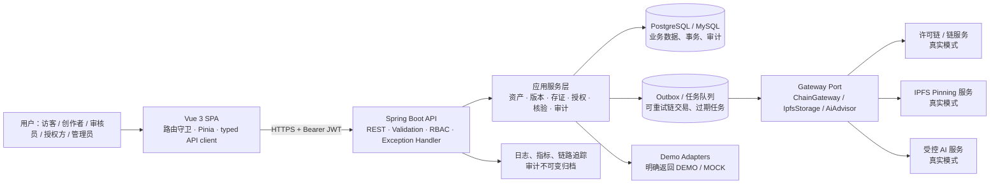
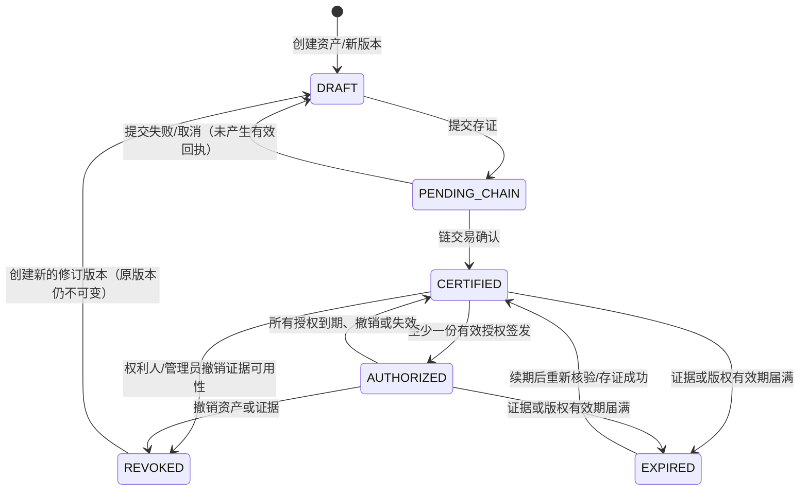

# 数字资产全生命周期架构设计

> 版本：v1.0（设计基线）
> 范围：星图共链——文旅数字资产版权存证平台。本文只定义目标架构与迁移边界，不代表已接入真实区块链、IPFS 或 AI 服务。

## 1. 现状与问题清单

### 已有基础

- `platform/`：Vue 3 + Vite + Ant Design Vue 前端，已有首页、资产管理、存证、查询、市场和性能展示页面。
- `backend/`：Spring Boot 3 + JPA，已有 `assets`、`evidence_records`、`chain_transactions`、`audit_logs` 实体与 H2/MySQL/PostgreSQL 驱动依赖。
- 存证服务已经具备服务层事务、请求 DTO 的基础必填校验，以及 `BlockchainGateway` 抽象接口。

### 需要优先治理的问题

| 编号 | 发现 | 风险/影响 | 建议 |
|---|---|---|---|
| A-01 | 已加入 **DEMO HTTP Basic** 和路由 RBAC，但尚无持久化用户/角色、JWT/OIDC 或资源归属校验。 | Demo 账户不适用于生产，多机构数据范围仍无法隔离。 | 以 JWT/OIDC 资源服务器和 `users`/`roles` 持久化替换 Demo 认证，并补充方法级资源权限。 |
| A-02 | `MockXuperChainGateway` 被默认注入，生成确定性伪 `txId` 和区块高度。 | 页面/接口容易被误认为真实上链。 | 显式 `DEMO`/`REAL` 服务模式、返回 `mode`，真实实现以 profile/配置切换。 |
| A-03 | 资产、存证、交易表以哈希字段弱关联；实体未配置外键关联。 | 版本、授权、撤销、重试链交易等无法可靠建模。 | 采用 UUID 主键与明确外键；保留哈希为业务检索字段。 |
| A-04 | 已增加 `asset_versions` 持久化基础，但现有存证接口仍直接使用 `assets.file_hash`。 | 新旧数据流尚未切换，同一资产修订暂不能经 API 管理。 | 下一阶段让 `assets` 管理逻辑资产，`asset_versions` 管理每一份可存证内容。 |
| A-05 | 存证在数据库事务中同步调用链网关。 | 外部调用超时/回滚不一致；失败后难以安全重试。 | 先持久化 `PENDING_CHAIN` 和 `chain_transactions`，再由可靠任务/Outbox 异步提交与确认。 |
| A-06 | `timestampIso`、`ownerName` 由客户端提交，哈希计算同时存在“文件+时间”和“文件内容”两种口径。 | 文件复验无法与存证哈希稳定对应，时间与操作者不可可信。 | 服务端生成时间；版本保存 `content_sha256`，存证载荷另保存 `evidence_digest`。 |
| A-07 | 当前已补充统一 JSON 错误、存证哈希校验和受限 CORS；仍缺少分页、排序和完整资源 DTO 校验。 | 列表和后续接口仍无法满足生产级查询治理。 | 继续扩展 Bean Validation、分页 DTO 与统一错误码。 |
| A-08 | 前端存证、查询、调用量和动态授权使用 localStorage、硬编码样例及 `setTimeout`。 | 多端数据不一致、刷新丢失/伪造，无法审计。 | 新建 typed API client 与 Pinia 数据源；Demo 数据须有醒目的模式标记。 |
| A-09 | 前端 `blockchain.js` 直接暴露链 SDK 和本地节点地址，但业务页面并未走后端。 | 私钥/节点策略无法保护，且前后端状态分叉。 | 浏览器只调用平台 API；链 SDK 仅在后端网关适配器使用。 |
| A-10 | AI 本地回退会返回规则生成的建议，未标记为模拟结果。 | 容易被解读为真实 AI 分析。 | 返回 `source=DEMO_RULE`/`REAL_MODEL` 和免责声明；真实 AI 采用服务端代理、脱敏与审计。 |
| A-11 | 当前审计操作者已改为认证用户名，但表结构仍只保存名称和文本详情，缺少主体 ID、请求追踪、结果、IP 与不可变策略。 | 取证能力与合规性不足。 | 审计记录 actor、动作、资源、前后状态、traceId、来源、结果，并限制修改/删除。 |
| A-12 | 已由 Flyway 接管运行时建表，`schema.sql` 保留但被禁用；当前仍为兼容旧实体保留 `ddl-auto:update`。 | 新旧 JPA 结构切换完成前，生产环境仍不能使用自动更新。 | 数据迁移覆盖所有实体后改为 `ddl-auto=validate`。 |

## 2. 目标：前后端分离架构

### 分层职责

| 层 | 职责 | 不应承担的职责 |
|---|---|---|
| Vue SPA | 表单校验、页面状态（加载/成功/失败/空数据）、上传分片协调、权限可见性。 | 直接调用区块链/IPFS、保存可信业务事实、决定权限。 |
| REST API | 身份认证、授权、参数校验、幂等、统一错误、资源表示。 | 直接拼接数据库/第三方协议细节。 |
| 应用服务 | 生命周期状态机、事务边界、领域规则、审计事件、任务编排。 | 伪造外部成功结果。 |
| 网关适配器 | 对链、IPFS、AI 的协议转换、超时、重试分类、健康检查。 | 业务状态迁移与鉴权决策。 |
| 数据与任务 | 关系数据、Outbox、审计归档和异步重试。 | 直接向用户暴露内部凭据。 |

### 建议的后端模块

`auth`、`user`、`asset`、`evidence`、`authorization`、`verification`、`storage`、`chain`、`audit`、`common`。每个模块保留 controller / application service / repository / DTO；网关接口置于 `integration`，真实与 Demo 实现以 profile 选择。

### 生命周期主流程

1. 创作者创建资产和初始版本，状态为 `DRAFT`；文件上传由服务端签发受限上传凭据或经后端中转。
2. 服务端计算/复算内容 SHA-256，写入 `ipfs_files`。真实模式成功固定后写 CID；Demo 模式只写明确标识为模拟的 CID，不称为真实 IPFS。
3. 用户提交存证。服务端校验资产归属、版本不可变性及幂等键，创建 `evidence_records` 与待执行 `chain_transactions`，版本转为 `PENDING_CHAIN`。
4. 异步任务调用 `ChainGateway`。收到可验证回执后保存原始回执摘要、交易号和区块高度，证据记录与版本转为 `CERTIFIED`；失败保留失败原因并允许受控重试。
5. 权利人创建、签发或撤销授权。有效授权存在时资产可显示 `AUTHORIZED`，但证据有效性仍由版本/存证记录判断。
6. 访客只可查询已公开或获授权范围内的核验结果；每次敏感查看、下载、授权与状态变更写审计。

## 3. 鉴权、审计与可靠性基线

### RBAC 最小角色

| 角色代码 | 核心权限 |
|---|---|
| `ADMIN` | 用户/角色管理、全局审计、配置与人工纠错。 |
| `CURATOR` | 管理本机构资产、版本、存证申请和展览资料。 |
| `RIGHTS_OWNER` | 管理本人/授权委托资产及授权合同。 |
| `REVIEWER` | 审核提交、查看受限证据，不可篡改权属。 |
| `LICENSEE` | 查看被授予内容、使用范围与授权凭证。 |
| `PUBLIC` | 仅访问公开展示与公开核验。 |

所有写接口须同时进行：认证、角色权限、资源归属/机构范围校验、Bean Validation、幂等控制、审计。ID 不等于授权；不能仅因知道 UUID 就可访问资源。

### 统一约定

- API 前缀：`/api/v1`；时间使用 UTC RFC 3339；主键对外采用 UUID。
- 成功响应使用资源 JSON；列表使用 `{items, page, size, total}`。错误统一为 `{code, message, traceId, fieldErrors?}`。
- 写请求支持 `Idempotency-Key`；存证、授权签发、撤销必须使用。重复请求返回原资源而不是重复提交外部交易。
- 审计日志以服务端认证主体为准；请求体仅保留脱敏摘要，禁止写入密码、令牌、私钥或完整文件内容。
- 大文件不放关系库或链上。链上只提交内容摘要、CID（如适用）、资产/版本标识、时间和签名摘要。

## 4. 真实模式与 Demo 模式

| 能力 | `REAL` | `DEMO` |
|---|---|---|
| 区块链 | `ChainGateway` 调用经配置的真实许可链/测试链，轮询或回调确认。 | `DemoChainGateway` 生成**明确标注为 MOCK 的**交易回执，不宣称上链。 |
| IPFS | 调用受控 Pinning/IPFS Gateway，验证 CID 可读取与固定状态。 | 仅生成 `demo://` 或 `demo-cid-*` 占位符，`storageMode=DEMO`。 |
| AI | 服务端调用获批准模型，记录模型/版本/提示词摘要/人工复核状态。 | 规则示例或固定演示文案，`source=DEMO_RULE`，不称为 AI 结论。 |
| 可观测性 | 上报真实耗时、错误、回执、重试。 | 仅记录模拟操作，性能页不得呈现为压测结果。 |

推荐配置：`platform.mode=DEMO|REAL`，`chain.provider=demo|xuper|...`，`storage.provider=demo|ipfs`。启动时校验：`REAL` 禁止使用 Demo 实现，缺少凭据或节点配置时启动失败；每个外部结果与 API 响应包含 `mode` 和 `provider`。

## 5. 状态机

状态作用于 `assets.current_status`，具体不可变文件以 `asset_versions.status` 为准。

| 状态 | 定义 | 允许操作 |
|---|---|---|
| `DRAFT` | 元数据或文件版本尚未完成可信存证。 | 编辑元数据、替换草稿文件、删除草稿（软删除）、提交存证。 |
| `PENDING_CHAIN` | 存证请求已经受理，正等待链网关结果。 | 查询进度、受控重试；禁止修改该版本内容。 |
| `CERTIFIED` | 存证交易已经由真实链确认，或 Demo 中明确模拟确认。 | 查询核验、创建授权、创建新版本、申请撤销。 |
| `AUTHORIZED` | `CERTIFIED` 且至少一份授权在当前时间有效。 | 同 `CERTIFIED`，并允许授权范围内使用。 |
| `EXPIRED` | 版权/证据有效期已到；由定时任务或查询时惰性更新。 | 续期、查看历史、创建新存证；禁止新授权。 |
| `REVOKED` | 经具有权限的主体撤销；保留原因、依据和审计。 | 只读查看撤销原因；不能恢复原版本，需新版本重新存证。 |

`AUTHORIZED` 是派生展示状态，不能替代 `authorizations.status`；多个授权并存时以任一有效授权为准。每次状态迁移都必须记录 actor、reason、前后状态和关联交易/授权 ID。

## 6. 当前实现边界（2026-07）

- 已实现：BCrypt 密码哈希、JWT、`GUEST`/`CREATOR`/`MUSEUM_ADMIN`/`SUPER_ADMIN` 角色、资产所有者/机构/全平台范围校验、统一异常响应和操作审计。
- 已实现：资产发行后的版本历史、Demo IPFS 记录、授权创建/批量创建/撤销、每日与查询时到期失效、生命周期时间轴、按资产编号/哈希/CID/交易 ID 溯源，以及 JSON 溯源报告导出。
- Demo 边界：默认链与 IPFS 模式均为 `DEMO`；`demo-cid-*`、`demo_tx_*`、`demo_auth_tx_*` 都是模拟标识，不是实际 IPFS CID 或真实链上交易。`REAL` 适配器在缺少经验证 SDK、凭据和节点配置时会拒绝操作，不生成伪回执。
- 尚未实现：真实链/IPFS 适配、异步 Outbox、刷新令牌、可下载的实际文件存储、正式的合同/电子签章流程与法律效力认定。这些能力上线前不能将平台表述为“法律意义上的版权确权”。
