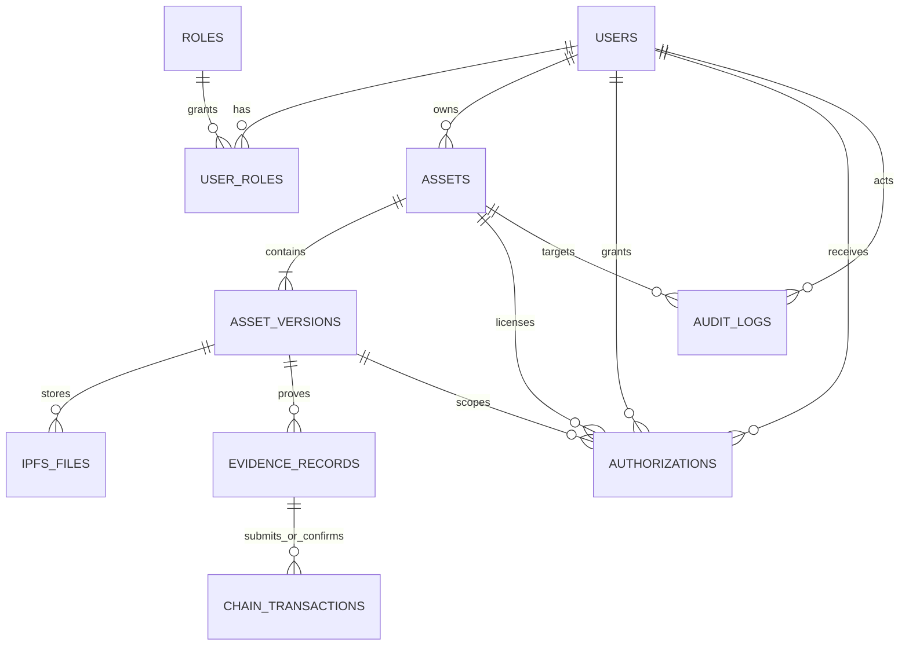

# 数据库 ER 与核心表设计

> 目标数据库：生产优先 PostgreSQL 16+，兼容 MySQL 8。字段类型以 PostgreSQL 表示；实现时用 Flyway 维护版本化迁移，不采用 JPA 自动建表作为生产迁移机制。

## 1. ER 模型

`user_roles` 是必要的关联表（`user_id`, `role_id`, `created_at`，联合唯一）；`assets.owner_user_id` 为权利归属主体，`creator_name` 是作品创作者展示信息，二者不可混用。`asset_versions`、`evidence_records`、`authorizations` 和 `chain_transactions` 都保留时间事实，历史数据不覆盖更新。

## 2. 通用约定

- 所有 ID 均为 `UUID`，由服务端生成；对外不暴露连续整型 ID。
- 所有时间用 `TIMESTAMPTZ`（UTC）；所有表有 `created_at`，可变主数据另有 `updated_at` 与可选 `deleted_at`。
- 枚举以 `VARCHAR(32)` + 应用层枚举/数据库 `CHECK` 实现，避免数据库特定 enum 迁移难题。
- 文件内容摘要使用 `CHAR(64)` 保存不含前缀的小写 SHA-256；API 层可呈现 `sha256:<hex>`。
- `JSONB` 用于可扩展元数据、策略或脱敏载荷；不能用 JSONB 替代关键筛选字段或外键。
- 所有外键默认 `RESTRICT`；资产与证据不可物理级联删除。按数据保留制度做归档与软删除。

## 3. 核心表字段

### 3.1 `users`

| 字段 | 类型/约束 | 说明 |
|---|---|---|
| `id` | UUID PK | 用户主键。 |
| `username` | varchar(64) UNIQUE NOT NULL | 登录名，规范化后唯一。 |
| `password_hash` | varchar(255) NULL | 本地认证使用 Argon2id/bcrypt；SSO 用户可为空。 |
| `display_name` | varchar(128) NOT NULL | 审计和页面展示名。 |
| `email` | varchar(254) UNIQUE NULL | 加密/脱敏展示，验证状态另存。 |
| `organization_name` | varchar(128) NULL | 展示机构；多租户后应替换为 `organization_id`。 |
| `status` | varchar(32) NOT NULL | `ACTIVE`、`DISABLED`、`LOCKED`、`PENDING`。 |
| `last_login_at` | timestamptz NULL | 最近成功登录时间。 |
| `created_at` / `updated_at` | timestamptz NOT NULL | 生命周期时间。 |

### 3.2 `roles`

| 字段 | 类型/约束 | 说明 |
|---|---|---|
| `id` | UUID PK | 角色主键。 |
| `code` | varchar(64) UNIQUE NOT NULL | 稳定代码，如 `ADMIN`、`CURATOR`。 |
| `name` | varchar(128) NOT NULL | 中文展示名。 |
| `description` | varchar(500) NULL | 权限说明。 |
| `permissions` | jsonb NOT NULL DEFAULT `[]` | 细粒度权限代码集合，供后续 ABAC 扩展。 |
| `is_system` | boolean NOT NULL DEFAULT false | 系统角色不可由普通管理员删除。 |
| `created_at` / `updated_at` | timestamptz NOT NULL | 生命周期时间。 |

### 3.3 `assets`

| 字段 | 类型/约束 | 说明 |
|---|---|---|
| `id` | UUID PK | 逻辑资产标识。 |
| `asset_code` | varchar(64) UNIQUE NOT NULL | 人可读业务编号，如 `AST-20260726-...`。 |
| `title` | varchar(255) NOT NULL | 资产名称。 |
| `asset_type` | varchar(32) NOT NULL | `IMAGE`、`VIDEO`、`AUDIO`、`MODEL_3D`、`DOCUMENT` 等。 |
| `owner_user_id` | UUID FK → users NOT NULL | 当前权利归属用户。 |
| `creator_name` | varchar(255) NOT NULL | 作者/创作团队事实。 |
| `organization_name` | varchar(255) NULL | 馆藏/所属机构展示字段。 |
| `description` | text NULL | 内容说明。 |
| `metadata` | jsonb NOT NULL DEFAULT `{}` | 文博扩展元数据，如年代、材质、展陈标签。 |
| `current_version_id` | UUID FK → asset_versions NULL | 当前展示版本；迁移时延后加 FK 避免循环创建。 |
| `current_status` | varchar(32) NOT NULL | 本文架构定义的状态机状态。 |
| `visibility` | varchar(32) NOT NULL | `PRIVATE`、`ORG`、`PUBLIC`。 |
| `copyright_expires_at` | timestamptz NULL | 权利有效期（若适用）。 |
| `created_at` / `updated_at` / `deleted_at` | timestamptz | 软删除仅适用于未存证或按制度隐藏。 |

索引：`(owner_user_id, current_status)`、`(asset_type, visibility)`、`GIN(metadata)`；全文检索可用 `title`/`description` 的 generated tsvector。

### 3.4 `asset_versions`

| 字段 | 类型/约束 | 说明 |
|---|---|---|
| `id` | UUID PK | 版本标识。 |
| `asset_id` | UUID FK → assets NOT NULL | 所属逻辑资产。 |
| `version_no` | integer NOT NULL | 从 1 递增；与 `asset_id` 联合唯一。 |
| `content_sha256` | char(64) NOT NULL | 纯文件内容 SHA-256；与资产联合唯一。 |
| `original_filename` | varchar(512) NOT NULL | 原始文件名，仅展示/审计。 |
| `mime_type` | varchar(127) NOT NULL | 服务端检测后的 MIME。 |
| `file_size_bytes` | bigint NOT NULL CHECK `>= 0` | 文件大小。 |
| `storage_status` | varchar(32) NOT NULL | `PENDING`、`STORED`、`FAILED`、`DELETED`。 |
| `status` | varchar(32) NOT NULL | 版本状态机状态。 |
| `submitted_by_user_id` | UUID FK → users NOT NULL | 提交者。 |
| `change_note` | varchar(1000) NULL | 修订说明。 |
| `metadata_snapshot` | jsonb NOT NULL DEFAULT `{}` | 存证时元数据快照。 |
| `immutable_at` | timestamptz NULL | 提交存证后设置，之后禁止改内容。 |
| `created_at` | timestamptz NOT NULL | 创建时间。 |

约束：`UNIQUE(asset_id, version_no)`、`UNIQUE(asset_id, content_sha256)`。内容修改必须新建版本，不能 UPDATE 已不可变版本。

### 3.5 `ipfs_files`

| 字段 | 类型/约束 | 说明 |
|---|---|---|
| `id` | UUID PK | 存储对象记录。 |
| `asset_version_id` | UUID FK → asset_versions NOT NULL | 关联版本。 |
| `provider` | varchar(32) NOT NULL | `IPFS_PINNING`、`S3`、`DEMO`。 |
| `mode` | varchar(16) NOT NULL | `REAL` 或 `DEMO`。 |
| `cid` | varchar(255) NULL | 真实 IPFS CID；Demo 只允许 `demo-cid-*`。 |
| `gateway_url` | varchar(2048) NULL | 可访问网关，不存带密钥 URL。 |
| `content_sha256` | char(64) NOT NULL | 上传后复核的内容摘要。 |
| `size_bytes` | bigint NOT NULL | 存储对象大小。 |
| `pin_status` | varchar(32) NOT NULL | `PENDING`、`PINNED`、`FAILED`、`UNPINNED`。 |
| `provider_request_id` | varchar(255) NULL | 外部请求追踪 ID。 |
| `error_code` / `error_message` | varchar(64) / varchar(1000) NULL | 脱敏失败信息。 |
| `pinned_at` / `verified_at` / `created_at` | timestamptz | 固定与读取校验事实。 |

索引：`(asset_version_id, pin_status)`、`UNIQUE(provider, cid)`（CID 不为空时）。

### 3.6 `evidence_records`

| 字段 | 类型/约束 | 说明 |
|---|---|---|
| `id` | UUID PK | 存证记录标识。 |
| `evidence_no` | varchar(64) UNIQUE NOT NULL | 对外存证编号。 |
| `asset_version_id` | UUID FK → asset_versions NOT NULL | 被证明的不可变版本。 |
| `content_sha256` | char(64) NOT NULL | 文件摘要快照，便于核验索引。 |
| `evidence_digest` | char(64) NOT NULL | 规范化存证载荷的 SHA-256。 |
| `owner_user_id` | UUID FK → users NOT NULL | 提交时权利人快照。 |
| `evidence_payload` | jsonb NOT NULL | 上链载荷的脱敏规范化快照。 |
| `chain_network` | varchar(128) NOT NULL | 目标网络名称。 |
| `contract_address` | varchar(255) NULL | 合约地址/名称。 |
| `mode` | varchar(16) NOT NULL | `REAL` 或 `DEMO`。 |
| `status` | varchar(32) NOT NULL | `PENDING`、`CONFIRMED`、`FAILED`、`REVOKED`。 |
| `certified_at` | timestamptz NULL | 确认时间。 |
| `expires_at` | timestamptz NULL | 证据有效期（若业务要求）。 |
| `revoked_at` / `revoked_reason` | timestamptz / varchar(1000) NULL | 撤销事实。 |
| `created_at` | timestamptz NOT NULL | 受理时间。 |

索引：`UNIQUE(asset_version_id, evidence_digest)`、`(content_sha256)`、`(status, created_at DESC)`；只有 `mode=REAL AND status=CONFIRMED` 才能宣称真实存证。

### 3.7 `authorizations`

| 字段 | 类型/约束 | 说明 |
|---|---|---|
| `id` | UUID PK | 授权标识。 |
| `authorization_no` | varchar(64) UNIQUE NOT NULL | 对外授权编号。 |
| `asset_id` | UUID FK → assets NOT NULL | 授权资产。 |
| `asset_version_id` | UUID FK → asset_versions NULL | 空表示全资产/未来版本按合同另行解释；推荐精确到版本。 |
| `licensor_user_id` | UUID FK → users NOT NULL | 授权方，需校验权属。 |
| `licensee_user_id` | UUID FK → users NULL | 已注册被授权方；外部主体另存名称/联系信息。 |
| `licensee_name` | varchar(255) NOT NULL | 合同主体快照。 |
| `license_type` | varchar(32) NOT NULL | `NON_EXCLUSIVE`、`EXCLUSIVE`、`EXHIBITION`、`EDUCATION` 等。 |
| `usage_scope` | jsonb NOT NULL | 地域、媒介、用途、次数、是否可转授权等。 |
| `starts_at` / `ends_at` | timestamptz NOT NULL | 有效期，`ends_at > starts_at`。 |
| `status` | varchar(32) NOT NULL | `DRAFT`、`ACTIVE`、`EXPIRED`、`REVOKED`、`REJECTED`。 |
| `contract_ref` | varchar(255) NULL | 合同编号/外部凭证引用。 |
| `issued_by_user_id` | UUID FK → users NOT NULL | 实际签发人。 |
| `revoked_at` / `revoke_reason` | timestamptz / varchar(1000) NULL | 撤销事实。 |
| `created_at` / `updated_at` | timestamptz NOT NULL | 生命周期时间。 |

索引：`(asset_id, status, ends_at)`、`(licensee_user_id, status)`。应用层需检查同一范围的独占授权冲突。

### 3.8 `chain_transactions`

| 字段 | 类型/约束 | 说明 |
|---|---|---|
| `id` | UUID PK | 提交尝试标识。 |
| `evidence_record_id` | UUID FK → evidence_records NOT NULL | 对应存证记录。 |
| `parent_transaction_id` | UUID FK → chain_transactions NULL | 重试/替换交易链。 |
| `provider` | varchar(64) NOT NULL | 网关实现标识。 |
| `mode` | varchar(16) NOT NULL | `REAL` 或 `DEMO`。 |
| `network` | varchar(128) NOT NULL | 网络。 |
| `contract_address` / `method_name` | varchar(255) / varchar(128) NOT NULL | 合约调用信息。 |
| `idempotency_key` | varchar(128) NOT NULL | 外部提交去重键。 |
| `request_digest` | char(64) NOT NULL | 规范化请求摘要，不保存秘密。 |
| `tx_hash` | varchar(255) NULL | 真实或 Demo 交易标识。 |
| `block_height` | bigint NULL | 链确认高度。 |
| `status` | varchar(32) NOT NULL | `QUEUED`、`SUBMITTED`、`CONFIRMED`、`FAILED`、`TIMEOUT`。 |
| `attempt_no` | integer NOT NULL DEFAULT 1 | 第几次提交。 |
| `submitted_at` / `confirmed_at` | timestamptz NULL | 链路时间。 |
| `error_code` / `error_message` | varchar(64) / varchar(1000) NULL | 脱敏错误。 |
| `receipt_payload` | jsonb NULL | 允许保留的回执字段；不可存私钥。 |
| `created_at` / `updated_at` | timestamptz NOT NULL | 生命周期时间。 |

索引：`UNIQUE(provider, network, tx_hash)`（非空时）、`UNIQUE(evidence_record_id, idempotency_key)`、`(status, created_at)`。

### 3.9 `audit_logs`

| 字段 | 类型/约束 | 说明 |
|---|---|---|
| `id` | UUID PK | 审计事件标识。 |
| `occurred_at` | timestamptz NOT NULL | 服务端发生时间。 |
| `actor_user_id` | UUID FK → users NULL | 认证主体；匿名访问为空。 |
| `actor_type` | varchar(32) NOT NULL | `USER`、`SYSTEM`、`ANONYMOUS`。 |
| `action` | varchar(64) NOT NULL | 如 `ASSET_CREATE`、`EVIDENCE_SUBMIT`。 |
| `resource_type` / `resource_id` | varchar(64) / UUID NULL | 被操作资源。 |
| `asset_id` | UUID FK → assets NULL | 常用资产维度索引。 |
| `outcome` | varchar(16) NOT NULL | `SUCCESS`、`FAILURE`、`DENIED`。 |
| `before_state` / `after_state` | jsonb NULL | 脱敏状态差异，不记录文件内容。 |
| `detail` | jsonb NOT NULL DEFAULT `{}` | 请求摘要、理由、外部关联 ID。 |
| `request_id` / `trace_id` | varchar(128) NULL | 关联访问日志和链路。 |
| `source_ip` | inet NULL | 访问来源；依隐私制度保留。 |
| `user_agent` | varchar(512) NULL | 客户端摘要。 |
| `prev_hash` / `entry_hash` | char(64) NULL | 可选哈希链，支撑篡改检测。 |

索引：`(asset_id, occurred_at DESC)`、`(actor_user_id, occurred_at DESC)`、`(action, occurred_at DESC)`。应用账号仅允许 INSERT/SELECT；归档账户权限独立。

## 4. 关键完整性规则与迁移策略

1. 资产状态由服务层根据当前版本、有效授权、证据有效期派生或在同一事务更新；禁止客户端直接写 `current_status`。
2. `PENDING_CHAIN` 的链交易可重试；同一证据的请求必须复用幂等键，避免重复真实上链。
3. `REVOKED`、`EXPIRED` 是历史事实，不删除原链交易、存证或审计日志。
4. 当 `ipfs_files.mode=DEMO` 或 `evidence_records.mode=DEMO` 时，API/页面必须显示 Demo/Mock；数据库约束和服务校验禁止将其标为真实。
5. 先以新表并行写入和只读查询迁移现有原型数据，再切换接口；不能用迁移脚本直接删除旧表或覆盖用户数据。

### 当前实施状态

`V1__legacy_evidence_schema.sql` 固化现有原型表；`V2__lifecycle_foundation.sql` 以非破坏性方式新增 `roles`、`user_roles`、`asset_versions` 和 `ipfs_files`，并扩充 `users`、`assets`。当前兼容接口仍保留旧资产字段，同时已增加版本、IPFS、授权和溯源 REST API；这保证了迁移可以在不删除原有数据的情况下分阶段上线。

### 授权与溯源实施状态

`V6__authorizations_and_provenance.sql` 新增 `authorizations`：以 UUID 字符串 ID、唯一 `authorization_no`、资产/版本/授权方引用、被授权主体快照、商用属性、分润比例、有效期、状态、撤销事实以及关联链交易 ID 为核心字段。该迁移只新增表和索引，不修改或删除既有资产、存证、版本、IPFS、链交易和审计数据。

版本仍使用 `asset_versions` 的 `(asset_id, version_no)` 和 `(asset_id, content_sha256)` 唯一约束，保证同一资产的历史哈希不会被覆盖。授权状态变化、版本创建和授权链提交都会写入 `audit_logs`；实际授权链交易复用 `chain_transactions`，禁止存放节点私钥或其他秘密。
